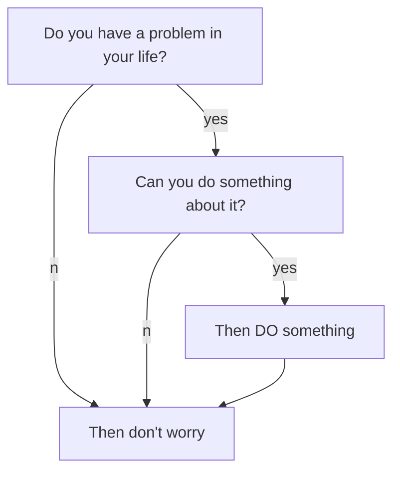

Welcome ! :smile:

```mermaid
graph TB;
    A[Do you have a problem in your life?]
    B[Then don't worry]
    C[Can you do something about it?]
    D[Then DO something]
    A--no-->B;
    A--yes-->C;
    C--no-->B;
    C--yes-->D;
    D-->B;
```

(The graph is adapted from the [template documentation](https://tianqi.name/jekyll-TeXt-theme/docs/en/markdown-enhancements))